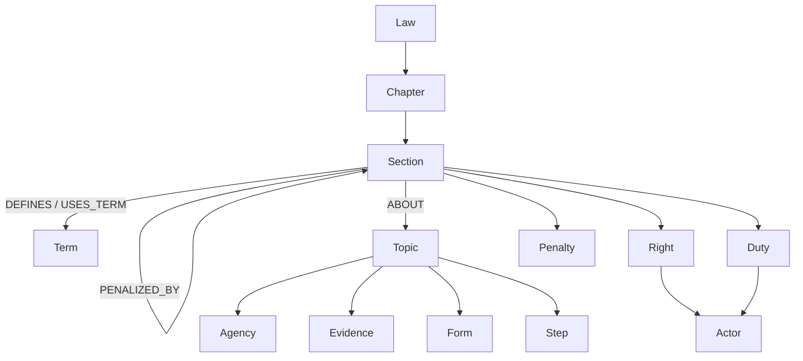

# Graph schema diagram

The offline graph artifact is `data/graph.json`; `visualisation.svg` contains
the generated graph view. A live Neo4j Browser capture remains pending until
the Docker/Neo4j service is available.
