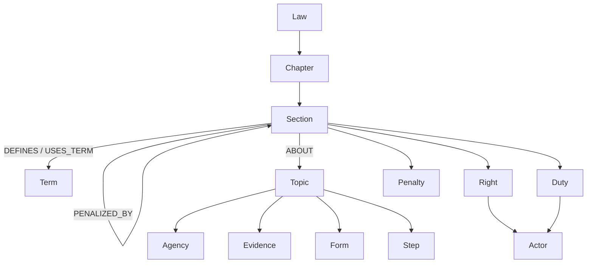

# Graph schema diagram

```mermaid
flowchart TD
  Law --> Chapter --> Section
  Section -->|REFERS_TO| Section
  Section -->|PENALIZED_BY| Section
  Section -->|DEFINES / USES_TERM| Term
  Section -->|ABOUT| Topic
  Topic --> Agency
  Topic --> Evidence
  Topic --> Form
  Topic --> Step
  Section --> Right
  Section --> Duty
  Section --> Penalty
  Right --> Actor
  Duty --> Actor
```

The offline graph artifact is `data/graph.json` (326 nodes / 720 edges, see
`doc/data_quality.md`); `visualisation.svg` (this dir) contains the generated graph view.
`eval/neo4j_results/screenshot_*.png` are Neo4j Browser captures but are
**stale** (taken against an earlier deterministic-only load, 211 nodes / 3
labels) — see `doc/data_quality.md`'s "Known limitations" for the exact
command to reload the current merged graph and re-capture.
