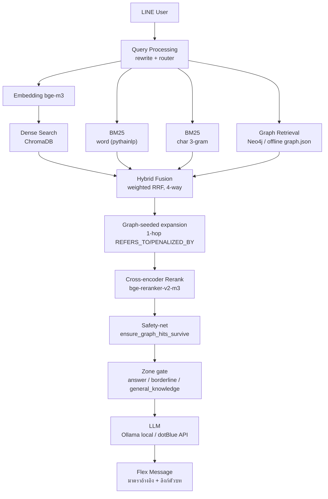
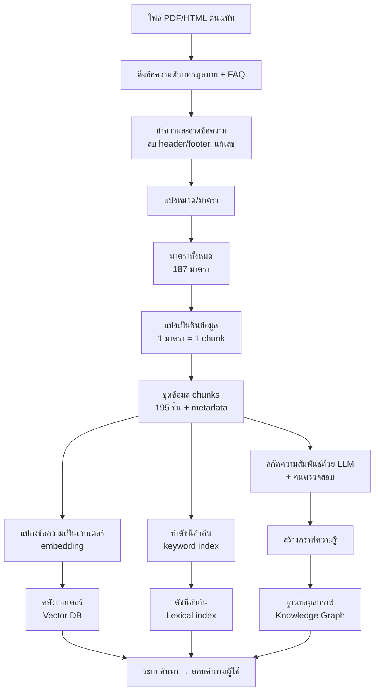
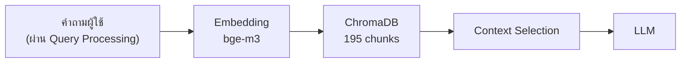

# ThaiLaw Assistant — สไลด์นำเสนอ Final Project 10 นาที

> ฉบับออกแบบจากโค้ด เอกสารโครงการ (`doc/report.md`, `doc/data_quality_report.md`, `doc/SPLIT.md`) และ `doc/Rubric ระดับคุณภาพสำหรับประเมิน Final Project.docx`
>
> เป้าหมายการนำเสนอ: ให้กรรมการเห็นหลักฐานครบทั้ง 8 ด้านที่ rubric ให้คะแนน (Data, Dense, Graph, Hybrid, Local LLM, API LLM, Integration, Evaluation) แยกเป็นหน้าชัดเจน ไม่รวบรัดจนหลักฐานตกหล่น

## แนวทางใช้ไฟล์นี้

- ใช้ 14 หน้า เวลารวมประมาณ 9:35 (เผื่อ buffer ~25 วิ ก่อนชน 10:00 จริง) — ซ้อมให้จบใน 9:30 เพื่อกันเวลาล้น
- สไลด์ใส่ข้อความสั้น ผู้พูดใช้ส่วน "คำพูด"
- **ตัวเลขทุกตัวในไฟล์นี้ดึงจาก `doc/report.md` เฉพาะ "รอบล่าสุด/final" เท่านั้น** — ห้ามผสมตัวเลขรอบกลางทาง (เช่น unit test 104/107/117 หรือ judge correctness รอบ 1–2) ยกเว้นจุดที่ตั้งใจโชว์ before/after ของบั๊กเดียวกัน (ระบุชัดว่าเป็น "ก่อนแก้ / หลังแก้" ไม่ใช่ "รอบที่ 1/2/3")
- จุดที่เขียนว่า `[แคปภาพ]` ต้องใช้ภาพจากระบบจริง — ดู checklist ท้ายไฟล์ว่าภาพไหนมีแล้ว ภาพไหนต้องแคปเพิ่ม
- ใช้โทนวิชาการ-มืออาชีพ: พื้นหลัง navy, accent teal/orange, ตัวเลขสำคัญตัวใหญ่
- `[ชื่อสมาชิกทีม]` ยังเป็น placeholder ตามที่ตกลง — เติมเองภายหลัง

## เวลาโดยรวม

| หน้า | หัวข้อ | เวลา | รับผิดชอบ rubric ข้อ |
|---|---|---:|---|
| 1 | ชื่อโครงการ | 15s | — |
| 2 | ปัญหาและเป้าหมาย | 25s | บริบท |
| 3 | Architecture ภาพรวม | 30s | System Integration (ภาพรวม) |
| 4 | Data และ Knowledge Base | 45s | **1. Data & Knowledge Base** |
| 5 | Dense RAG | 40s | **2. Dense RAG** |
| 6 | Graph RAG | 40s | **3. Graph RAG** |
| 7 | Hybrid RAG: หัวใจของระบบ | 80s | **4. Hybrid RAG** (20 คะแนน — มากสุด) |
| 8 | Local LLM | 30s | **5. Local LLM** |
| 9 | API LLM | 40s | **6. API LLM** |
| 10 | System Integration & Error Handling | 35s | **7. System Integration** |
| 11 | Live Demo บน LINE | 80s | Integration (หลักฐานสด) |
| 12 | Evaluation และบทเรียนจากบั๊กจริง | 55s | **8. Evaluation & Analysis** |
| 13 | สรุปและข้อจำกัด | 25s | ภาพรวม |
| 14 | Rubric Self-score สรุปคะแนนตนเอง | 35s | Documentation/Presentation |

รวม ≈ 575 วินาที (9:35)

---

## Slide 1 — ThaiLaw Assistant

### ข้อความบนสไลด์

**ThaiLaw Assistant**
ผู้ช่วยกฎหมายแรงงานไทยด้วย Hybrid Dense + Graph RAG บน LINE

ทีม: คีตศิลป์ คงสี, `[ชื่อสมาชิกทีม]`

**จุดขาย:** ตอบพร้อมอ้างอิงมาตราจริง ตรวจสอบย้อนกลับได้ — ครบทุกองค์ประกอบตาม Rubric

### ภาพที่ใส่

- `[แคปภาพ]` หน้าจอ LINE ที่มีคำถามและคำตอบ 1 ใบ แบบเบลอข้อมูลส่วนตัว (ต้องแคปใหม่ — ดู checklist)
- ใส่ไอคอน LINE ขนาดเล็ก และเส้นกราฟความรู้เป็นพื้นหลังจาง ๆ

### หลักฐานกำกับบนสไลด์

`หลักฐาน: src/app/app_line.py · src/app/flex.py · ภาพ LINE จริง`

### คำพูด

"ทีมเราพัฒนา ThaiLaw Assistant ผู้ช่วยตอบคำถามกฎหมายแรงงานไทยบน LINE โดยผสาน Dense Retrieval, Graph Retrieval และ LLM แบบ Hybrid RAG พร้อมอ้างอิงมาตราจริง วันนี้จะพาดูทุกองค์ประกอบพร้อมหลักฐานผลทดลองจริง"

---

## Slide 2 — ปัญหาและเป้าหมาย

### ข้อความบนสไลด์

**ปัญหา**

- พ.ร.บ.คุ้มครองแรงงาน พ.ศ. 2541 มี 187 มาตรา
- ผู้ใช้ทั่วไปหา "มาตราที่เกี่ยวข้อง" ได้ยาก
- คำถามบางข้อเชื่อมหลายส่วน เช่น สิทธิ หน้าที่ ขั้นตอน และบทลงโทษ

**เป้าหมาย**

- ตอบเร็วบนช่องทางที่ผู้ใช้คุ้นเคย: LINE
- ใช้ข้อมูลกฎหมายที่ตรวจสอบได้ ไม่ hallucinate
- รองรับทั้งคำถามตรงตัวและคำถามที่ต้องเชื่อมความสัมพันธ์

### ภาพที่ใส่

- `[แคปภาพ]` ตัวอย่างหน้ากฎหมายที่มีข้อความยาว หรือภาพผู้ใช้ค้นข้อมูลหลายหน้า (optional — ใช้ไอคอน/แผนภาพแทนได้ถ้าไม่มีเวลาแคป)
- แผนภาพ "คำถามผู้ใช้ → มาตราที่เกี่ยวข้อง"

### หลักฐานกำกับบนสไลด์

`หลักฐาน: doc/โจทย์.md · doc/หัวข้อ_ผู้ช่วยกฎหมายไทย.md · data/raw/`

### คำพูด

"ปัญหาไม่ได้อยู่ที่การมีข้อมูลกฎหมายเท่านั้น แต่อยู่ที่การหาและเชื่อมมาตราที่เกี่ยวข้องให้ถูกต้อง ระบบจึงต้องตอบพร้อมแหล่งอ้างอิง ไม่ใช่สร้างคำตอบจากความจำของโมเดล"

---

## Slide 3 — Architecture ภาพรวม

### ข้อความบนสไลด์

วางไฟล์ `.mmd` นี้เข้า draw.io ผ่าน **Extras → Edit Diagram... → เลือก Mermaid** (หรือ File → Import from → เก็บ code ไว้แปะ) เพื่อ generate diagram แก้ต่อได้

**หน้านี้แค่ภาพรวม** — รายละเอียด Dense/Graph/Hybrid/LLM/Integration แยกพูดหน้าถัดไปทีละส่วน

### ภาพที่ใส่

- `[แคปภาพ]` Rich Menu บน LINE: `doc/slides_assets/rich_menu.png` (ต้องแคปใหม่)
- วางภาพด้านขวาของ architecture, แคปชั่น: "UX จริงบน LINE — กด rich menu แทนพิมพ์คำสั่ง"

### หลักฐานกำกับบนสไลด์

`หลักฐาน: src/app/engine.py · src/app/app_line.py · src/retrieval/fusion.py · src/llm/client.py`

### คำพูด

"ผู้ใช้เริ่มจาก LINE ระบบปรับคำถามและเลือกเส้นทาง จากนั้นดึงข้อมูลทั้ง Dense และ Graph รวมผลด้วย weighted RRF แล้ว rerank ก่อนส่ง context ให้ LLM สุดท้ายตอบกลับเป็น Flex Message พร้อมมาตราอ้างอิง — รายละเอียดแต่ละกล่องจะอธิบายทีละส่วนต่อจากนี้"

---

## Slide 4 — Data และ Knowledge Base

### ข้อความบนสไลด์

**Data preparation**

- กฎหมาย 1 ฉบับ: พ.ร.บ.คุ้มครองแรงงาน พ.ศ. 2541, 18 หมวด
- 187 มาตรา parse สำเร็จ `187/187` (sequential-continuity check กัน false-positive จาก wrapped citation)
- 195 chunks: structure-aware (1 มาตรา = 1 chunk, แยกเฉพาะมาตรายาวเกิน 1600 ตัวอักษร) — เฉลี่ย 415 ตัวอักษร/chunk
- Cross-reference (`refs_out`) 213 เส้น
- Cleaning: ลบ header/footer, แก้เลขไทย→อารบิก, รักษาเลขมาตราและลำดับหมวด
- Metadata: `section_no`, `chapter`, `source`, `chunk_id`, `text`, `section_key`

**Known limitation (ยอมรับตรงไปตรงมา):** PDF glyph corruption มากกว่า ~1.5% ที่เคยประเมินไว้ (สระ/วรรณยุกต์เลื่อนตำแหน่ง เช่น "ลูกจ้าง"→"ลกู จ้าง") — keyword search ตรงๆ พลาดได้แม้เนื้อหามีจริง ต้องอ่าน+ยืนยันด้วยคนสำหรับ topic สำคัญ ยังไม่แก้ที่ต้นตอ (แผนต่อยอด: ย้ายไปใช้ HTML กฤษฎีกาแทน PDF)

**Knowledge Graph** (เตรียมพร้อมกันจากข้อมูลชุดเดียวกัน)

- 326 nodes, 720 edges, 12/13 node types ตามแผน (ขาดแค่ `Penalty` — ไม่มี `HAS_PENALTY` triple ในตัวอย่าง extraction), orphan nodes = 0
- Triple extraction 30 รายการ (LLM-extracted), human-approved 15/30 (50% แต่ไม่สุ่ม — ดูสไลด์ Graph RAG)

### Mermaid diagram: PDF → เก็บข้อมูล (สำหรับ draw.io)

วางเข้า draw.io ผ่าน **Extras → Edit Diagram... → เลือก Mermaid** เหมือนหน้า 3

**ข้อมูลชุดเดียวกัน เก็บไว้ 3 ที่ เพื่อใช้คนละหน้าที่:**

- **คลังเวกเตอร์ (Vector DB)** — `bge-m3` embed 195 chunks, หาความหมายใกล้เคียง
- **ดัชนีคำค้น (Lexical index)** — BM25 word+char 3-gram, จับคำ/เลขมาตราตรงตัว
- **ฐานข้อมูลกราฟ (Knowledge Graph)** — 326 nodes / 720 edges, ตอบคำถามที่ต้องเชื่อมหลายมาตรา

*(รายละเอียดเชิงลึกของ Dense/Graph อยู่หน้า 5–6)*

### ภาพที่ใส่

- `[แคปภาพ]` ตัวอย่าง chunk จริงจาก `data/chunks.jsonl` (1-2 แถว, เบลอถ้าจำเป็น) หรือ metadata schema
- ถ้ากรรมการถามลึก เปิด `doc/data_quality_report.md` ให้ดูสด

### หลักฐานกำกับบนสไลด์

`หลักฐาน: doc/data_quality_report.md · src/ingest/clean.py · src/ingest/parse_sections.py · src/ingest/chunk.py · data/chunks.jsonl`

### คำพูด

"เราเตรียมข้อมูลแบบ structure-aware โดยหนึ่งมาตราเป็นหนึ่ง chunk ทำให้รักษาเลขมาตราและบริบทได้ครบ parse สำเร็จครบ 187 มาตรา และเราตรวจพบเองว่า PDF ต้นทางมีปัญหา glyph corruption มากกว่าที่เคยประเมิน จึงบันทึกเป็นข้อจำกัดที่ยอมรับตรงไปตรงมา ไม่ปิดบัง"

---

## Slide 5 — Dense RAG

### ข้อความบนสไลด์

**Pipeline เต็ม:**

BM25 (lexical) และ Hybrid Fusion ไม่ใช่ส่วนของ Dense RAG ตาม rubric — อยู่ในสไลด์ 7 (Hybrid RAG) แล้ว หน้านี้โชว์แค่สาย Dense ล้วนๆ

วางเข้า draw.io ผ่าน **Extras → Edit Diagram... → เลือก Mermaid** เหมือนหน้าอื่น

**Tuning ที่ทำจริง (ไม่ใช่แค่ default config):**

| พารามิเตอร์ | ลองอะไร | สรุปสั้น |
|---|---|---|
| Top-K | 3 / 5 / 10 | **k=5 คุ้มสุด** (3→5 ดีขึ้นชัด, 5→10 แทบไม่ต่าง) |
| Threshold τ | ตัดคะแนนต่ำกว่าเกณฑ์ทิ้ง | **ใช้ไม่ได้** — τ=0.5 ทิ้งหมด 0% แม้คำตอบถูกก็โดนทิ้ง → ใช้ rerank ตัดสินแทน |
| Rerank | เปิด/ปิด | **เปิดดีกว่า** ทุก metric |
| Chunking | per-section vs fixed-512 | **per-section ดีกว่า** |

**Dense เดี่ยวๆ (Hit@1 ต่อหมวด):** lookup 0.38, single-hop 0.70, procedure 0.25, multi-hop 0.40

**ข้อจำกัดของ Dense ที่พบจริง:** อ่อนกับคำถามแบบ vocabulary gap ("ลาป่วย" vs ถ้อยคำกฎหมาย) และคำถาม procedure — เหตุผลที่ต้องมี Graph (สไลด์ถัดไป)

### ภาพที่ใส่

- ทำกราฟเส้น/แท่งเล็ก: threshold τ vs recall (0.4→14%, 0.5→0%) ให้เห็นผลชัดเจน
- หรือใช้ตารางด้านบนตรงๆ ถ้าไม่มีเวลาทำกราฟ

### หลักฐานกำกับบนสไลด์

`หลักฐาน: doc/report.md §3.3 · doc/retrieval_baseline.md · src/index/build_vector.py · src/index/build_bm25.py · src/retrieval/retriever.py`

### คำพูด

"Dense RAG ทำงานครบตั้งแต่ embedding ถึง LLM และเราไม่ได้ใช้ค่า default เฉยๆ — ทดลอง tune ทั้ง Top-K, threshold, rerank และวิธี chunking จริง พบว่า threshold แบบ cosine ดิบใช้ไม่ได้เลยกับกฎหมายไทย ต้องใช้ cross-encoder score แทน"

---

## Slide 6 — Graph RAG

### ข้อความบนสไลด์

**Knowledge Graph ที่มีความหมาย (ไม่ใช่แค่มี Neo4j):**

- 326 nodes / 720 edges, 12/13 node types: Law, Chapter, Section, Topic, Actor, Right, Duty, Penalty(ไม่มี), Evidence, Form, Step, ฯลฯ
- Relationship ที่มีความหมายจริง: `REFERS_TO`, `ABOUT`, `GRANTS_RIGHT`, `IMPOSES_DUTY`, `PENALIZED_BY`, `HELD_BY`, `BINDS`
- Triple validation ไม่สุ่ม: `GRANTS_RIGHT`/`IMPOSES_DUTY`/`ABOUT` approve 93% (15/16) แต่ `BINDS`/`HELD_BY` approve 0% (0/14) — root cause หาเจอ: โมเดลใส่ `subject_type` ผิดเป็นระบบ (labeled "นายจ้าง" เป็น `Duty` ทั้งที่ควรเป็น `Actor`) → แก้ด้วยการ reconstruct จาก subject ของ triple ที่ approved แทน

**Graph ช่วยแก้ข้อจำกัดของ Dense ได้จริง (ตัวอย่างที่ Dense ตอบไม่ดี):**

- Graph เดี่ยวๆ: recall@5 เพิ่มจาก `0.160` เป็น `0.310` หลังแก้ ABOUT edges (Topic↔Section, 1→35 เส้น)
- หมวด procedure: Dense เดี่ยวๆ Hit@1 = 0.25 → ผ่าน Graph (H4) ขึ้นเป็น **0.62**
- หมวด lookup: Dense 0.38 → Graph เดี่ยวๆ ก็ได้ **1.00** ทันที (เดินความสัมพันธ์ตรง ไม่ต้องพึ่ง semantic)

### ภาพที่ใส่

- `[แคปภาพ]` Neo4j Browser จาก query จริง: `eval/neo4j_results/screenshot_graph_overview_full.png` (มีพร้อมแล้ว ไม่ต้องแคปใหม่)
- เสริม (ถ้ามีที่): `eval/neo4j_results/screenshot_graph_section_penalized_by_full.png` โชว์ตัวอย่างความสัมพันธ์ PENALIZED_BY จริง
- ใส่ป้ายบนภาพ: `326 nodes / 720 edges — ยืนยันด้วย live query ไม่ใช่ stale`

### หลักฐานกำกับบนสไลด์

`หลักฐาน: doc/data_quality_report.md · doc/graph_schema.md · src/index/graph_core.py · src/retrieval/graph.py · eval/neo4j_results/table_node_counts.csv · eval/neo4j_results/table_relationship_counts.csv`

### คำพูด

"เราสร้าง Graph ที่มี node และ relationship ที่มีความหมายจริง ไม่ใช่แค่มี Neo4j ตั้งไว้เฉยๆ และพิสูจน์ได้ว่า Graph ช่วยแก้จุดที่ Dense ทำไม่ได้จริง โดยเฉพาะคำถาม procedure ที่ดีขึ้นจาก 0.25 เป็น 0.62 — เราถึงขั้นเจอบั๊กจริงในโค้ด graph retrieval เอง (คืนผลแบบสุ่มแทนที่จะเดิน edge จริง) และแก้แล้ว"

---

## Slide 7 — Hybrid RAG: หัวใจของระบบ

### ข้อความบนสไลด์

**Fusion pipeline:** Router (เลือก weight ตามประเภทคำถาม) → Weighted RRF (4 ทาง: dense/bm25-word/bm25-gram/graph) → Graph-seeded expansion (1-hop) → Cross-encoder rerank → Safety-net → Section Card ให้ LLM

**Hit@1 ต่อหมวดคำถาม (n คำถามในวงเล็บ):**

| หมวด | D (dense) | G (graph) | H4 (+router, ไม่ rerank) | H5 (dense+graph+rerank, ไม่รวม safety-net) |
|---|---:|---:|---:|---:|
| lookup (8) | 0.38 | **1.00** | **1.00** | **1.00** |
| single-hop (10) | 0.70 | 0.20 | **0.90** | 0.80 |
| procedure (8) | 0.25 | 0.38 | **0.62** | 0.50 |
| multi-hop (10) | 0.40 | 0.10 | 0.40 | 0.10 |

*หมายเหตุ: ตารางนี้รันจาก `eval/run_retrieval.py` ซึ่งจำลอง pipeline เท่านั้น ไม่ได้เรียก `engine.py` จริง — จึงไม่มี safety-net (`ensure_graph_hits_survive`) รวมอยู่ใน H5 คอลัมน์นี้ หลักฐานว่า safety-net ได้ผลจริงต้องดูจากการทดสอบตรงกับ engine เต็ม pipeline แทน (ดูหลักฐานสำรองท้ายไฟล์)*

**Finding สำคัญที่สุดของโครงการ:** cross-encoder rerank (`bge-reranker-v2-m3`) ตัดสินจาก**ความคล้ายข้อความล้วนๆ ไม่รู้จัก graph provenance** — พอ graph leg แข็งแรงขึ้น (H4) rerank กลับ**ดันผลลัพธ์ที่ถูกออกไป** (H4 ชนะ H5 เกือบทุกหมวด) → ทดลองปรับ router weight ก่อน แต่**ไม่ได้ผล** (candidate pool ไม่ขึ้นกับ weight, root cause คือ rerank ไม่ใช่ router — negative result ที่มีค่า) → แก้ด้วย **safety-net หลัง rerank** (`ensure_graph_hits_survive`) แทนที่จะแก้ rerank เอง (effort สูงกว่ามาก)

**Statistical test (D vs H5, bootstrap 95% CI + Wilcoxon, n=50):** mean diff +0.023, CI (−0.060, +0.113), **p = 0.52 — ไม่ significant ในภาพรวม** แต่ per-category ชนะ/แพ้ชัดเจนคนละทาง (หักล้างกันในค่าเฉลี่ยรวม)

**บทเรียน:** ต้องวิเคราะห์แยกตามประเภทคำถาม ไม่ดูค่าเฉลี่ยรวมอย่างเดียว — นี่คือเหตุผลที่ทุกตารางในสไลด์นี้แยก breakdown ตามหมวด

**หากกรรมการถามวิธีวัด:** Hit@1 = ผลลัพธ์อันดับหนึ่งตรงกับ section ที่กำหนดใน gold set; recall@5 = มี gold section อยู่ใน 5 ผลลัพธ์แรก

### ภาพที่ใส่

- ทำกราฟแท่ง 4 กลุ่ม: D, G, H4, H5 ต่อหมวด (ไฮไลต์ procedure 0.25→0.62)
- ใส่กล่องสีส้ม: "rerank ไม่รู้จัก graph provenance → แก้ด้วย safety-net"

### หลักฐานกำกับบนสไลด์

`หลักฐาน: doc/report.md §3.1–3.5, §5.1 · doc/retrieval_baseline.md · eval/run_retrieval.py · eval/analyze.ipynb · src/retrieval/fusion.py · src/retrieval/reranker.py`

### คำพูด

"นี่คือหัวใจของโครงการ และคะแนนหนักสุดของ rubric เราพบ finding ที่ไม่คาดคิดคือ reranker ไม่รู้ว่าผลลัพธ์มาจาก Graph จึงดันคำตอบที่ถูกออกไปเมื่อ graph leg แข็งแรงขึ้น เราลองแก้ที่ router ก่อนแต่ไม่ได้ผล วิเคราะห์จนเจอ root cause จริงว่าอยู่ที่ rerank แล้วแก้ด้วย safety-net แทน ผลรวมทางสถิติไม่ significant แต่ per-category ชนะ/แพ้ชัดเจนคนละทาง — เราเลือกรายงานอย่างตรงไปตรงมาแทนที่จะปัดตกความจริงข้อนี้"

---

## Slide 8 — Local LLM

### ข้อความบนสไลด์

- **เลือกโมเดลให้พอดี Hardware**: `qwen3.5:4b`, `gemma3:4b` (Ollama) บน GPU 6GB
- **ปรับ Configuration/Context**: `num_ctx` sweep 2048/4096/8192 + `CONTEXT_BUDGET_CHARS` แยกงบ local (6000 ตัวอักษร) เทียบ API

| Model | VRAM | Response Time เฉลี่ย (n=50) | Throughput (2048/4096/8192) |
|---|---:|---:|---|
| `qwen3.5:4b` | 3774–3972 MiB | **38.3s** | 24.7 / 22.4 / 22.5 tok/s |
| `gemma3:4b` | 3744–3972 MiB | **48.5s** | 27.2 / 26.5 / 29.0 tok/s |

ต่างกัน <15% ตาม num_ctx เพราะ context จริงสั้นกว่า 2048 tokens อยู่แล้ว

Local เหมาะควบคุมข้อมูลเอง + ไม่มีค่า API ต่อคำขอ, ข้อจำกัด: VRAM 6GB จำกัดขนาดโมเดล

### ภาพที่ใส่

- ตาราง VRAM/throughput ต่อ `num_ctx` (จาก `doc/report.md` §4.2) ทำเป็นกราฟแท่งเล็กถ้ามีเวลา
- ไม่จำเป็นต้องมีภาพหน้าจอ — ตัวเลขพอสื่อสารได้

### หลักฐานกำกับบนสไลด์

`หลักฐาน: src/llm/client.py · src/config.py · doc/report.md §4.2 · eval/results/generation_H5_local_qwen3.5-4b.csv · eval/results/generation_H5_local_gemma3-4b.csv`

### คำพูด

"เราเลือก Local LLM ให้พอดีกับ GPU 6GB ที่มี วัด VRAM และ throughput จริงที่หลาย context length พบว่า context ที่ระบบใช้จริงสั้นพอที่ num_ctx ใหญ่ขึ้นแทบไม่กระทบความเร็ว และวัด response time จริงจาก 50 คำถามด้วย — local ช้ากว่า API เล็กน้อย (38-48s vs 36s) แลกกับควบคุมข้อมูลได้เองและไม่มีค่า API ต่อคำขอ — เป็นข้อมูลที่ช่วยตัดสินใจตั้งค่า production"

---

## Slide 9 — API LLM

### ข้อความบนสไลด์

- dotBlue: `qwen/qwen3.6-flash` (หลัก), เทียบกับ `gpt-4o-mini`/`deepseek-chat` ในบาง config
- มี retry + fallback provider (api↔local) เมื่อคำตอบว่าง/ผู้ให้บริการมีปัญหา
- จัดการ prompt, context และ token budget แยกตาม local/api (`CONTEXT_BUDGET_CHARS`)

**Production bug ที่ค้นพบและแก้แล้ว (กระทบผู้ใช้จริงบน LINE ไม่ใช่แค่ eval):**

| | ก่อนแก้ | หลังแก้ |
|---|---:|---:|
| `NUM_PREDICT` | 512 | **2500** |
| คำตอบว่างเปล่า | **34%** ของคำถามจริง | **6%** |
| Correctness (judge, 1-5) | 1.40 | **4.14** (final) |

**Root cause ยืนยันด้วยการวัดตรง:** โมเดลต้องการ completion tokens **~1700-1800** ก่อนเริ่มตอบจริง (เผาไปกับ hidden reasoning แม้ส่ง `enable_thinking: False`) — ที่ 512 ตัดจบก่อนตอบเสมอ

### ภาพที่ใส่

- `[แคปภาพ]` Flex card คำตอบจริงบน LINE: `doc/slides_assets/flex_card.png` (ต้องแคปใหม่)
- ใส่ลูกศรอธิบายจุด "มาตราอ้างอิง" และ "อ่านตัวบทต้นฉบับ"

### หลักฐานกำกับบนสไลด์

`หลักฐาน: src/llm/client.py · src/config.py · src/app/generator.py · doc/report.md §4.0`

### คำพูด

"เราพบบั๊กจริงที่กระทบผู้ใช้จริงบน LINE — API ตอบว่างเปล่า 34% ของเวลา เพราะ token ถูกใช้กับ hidden reasoning ก่อนเริ่มคำตอบ เราวัด root cause ตรงๆ ด้วยการนับ completion tokens จนเจอว่าต้องการ ~1700-1800 tokens แก้ด้วยการเพิ่ม token budget และวัดซ้ำจน correctness เพิ่มจาก 1.40 เป็น 4.14 จาก 5"

---

## Slide 10 — System Integration & Error Handling

### ข้อความบนสไลด์

**Integration ที่สำคัญ:**

- Router เลือก weight ตามประเภทคำถาม (lookup/procedure/definition/multi-hop/general)
- Fusion รวมผล Dense + BM25 + Graph ด้วย weighted RRF ก่อน rerank
- Fallback provider สลับ Local↔API เมื่อผู้ให้บริการมีปัญหาหรือคำตอบว่าง/ไร้ประโยชน์
- Zone gate (`answer`/`borderline`/`general_knowledge`) ป้องกันคำตอบผิด พร้อม safety-net หลัง rerank
- คำสั่งเสริมสำหรับ debug สด: `/mode dense|graph|hybrid`, `/llm local|api`, `/debug`, `/reset`

**Error handling หลายชั้นที่พิสูจน์แล้วว่าจำเป็นจริง (ไม่ใช่ทฤษฎี):** Neo4j ล่ม → offline `data/graph.json` fallback, LLM ตอบว่าง/วนซ้ำ → retry ผู้ให้บริการอื่น, zone gate ตัดสินก่อน safety-net เติม hit (บั๊กจริงที่เจอ+แก้แล้ว — ดูสไลด์ Evaluation)

### ภาพที่ใส่

- ใช้ diagram เดียวกับ slide 3 ย่อเล็กลง หรือ screenshot `/debug` output จริง (ถ้าแคปทัน)
- ไม่จำเป็นต้องมีภาพใหม่ — เน้นพูดจาก diagram เดิม

### หลักฐานกำกับบนสไลด์

`หลักฐาน: src/app/engine.py · src/app/app_line.py · src/retrieval/router.py · src/retrieval/fusion.py`

### คำพูด

"ทุกองค์ประกอบทำงานเป็นระบบเดียวกันจริง ตั้งแต่ผู้ใช้ถามจน LLM ตอบกลับ พร้อม error handling หลายชั้นที่เราไม่ได้ออกแบบไว้เฉยๆ แต่พิสูจน์แล้วว่าจำเป็นจริงจากบั๊กที่เจอตอนทดสอบ LINE สด"

---

## Slide 11 — Live Demo บน LINE

### ข้อความบนสไลด์

**Demo flow (ขยายเวลาเทียบเวอร์ชัน 5 นาที — ใส่การเปรียบเทียบโหมดสดด้วย):**

1. ถาม: `ลูกจ้างลาป่วยได้กี่วันโดยได้รับค่าจ้าง` → แสดง Flex card และมาตราอ้างอิง
2. ถาม: `เลิกจ้างโดยไม่จ่ายเงินตามกฎหมายต้องรับผิดอย่างไร` → แสดงการเชื่อมมาตราเนื้อหา + มาตราโทษ/ดอกเบี้ยพร้อมกัน (จุดขายของ Graph)
3. พิมพ์ `/debug` ก่อนคำถามข้างต้น → โชว์ route, score และ latency จริง
4. ถ้าเหลือเวลา: `/mode dense` ถามคำถามเดิมเทียบกับ `/mode hybrid` ให้เห็นความต่างสดๆ

**ก่อนนำเสนอ:** เปิด Neo4j → รัน LINE webhook → เชื่อม HTTPS tunnel → ใช้ `/reset` → เตรียมภาพ Flex card เป็น backup หาก LINE/อินเทอร์เน็ตมีปัญหา

### ภาพที่ใส่

- ระหว่าง demo ใช้หน้าจอมือถือหรือ LINE Desktop จริง
- วางภาพ backup เล็กๆ มุมล่าง: `doc/slides_assets/flex_card.png`

### หลักฐานกำกับบนสไลด์

`หลักฐาน: src/app/app_line.py · src/app/engine.py · src/app/flex.py · ภาพ demo จริงหรือวิดีโอสำรอง (doc/demo_video_script.md)`

### คำพูด

"ต่อไปเป็นการทำงานจริงบน LINE คำถามแรกเป็น lookup เพื่อแสดงคำตอบและมาตราอ้างอิง คำถามที่สองแสดงจุดขายของ Graph ในการเชื่อมมาตราเนื้อหาและความรับผิดพร้อมกัน แล้วโชว์ `/debug` ให้เห็นเบื้องหลังว่าระบบตัดสินใจอย่างไร"

---

## Slide 12 — Evaluation และบทเรียนจากบั๊กจริง

### ข้อความบนสไลด์

**Evaluation ครบวงจร:**

- Retrieval ablation: 8 configs (D, D+R, G, H1–H5) × 50 คำถาม, production backend จริง (ChromaDB + bge-reranker-v2-m3 จริง ไม่ใช่ mock)
- Generation matrix: 7 configs (2 local + 3 API + 2 baseline)
- LLM-as-judge: 5 metrics (correctness, faithfulness, citation accuracy, clarity, key-point coverage) — คะแนนสุดท้าย overall correctness **4.14/5** (50/50 พาร์สสำเร็จ)
- Error analysis 20 เคส สรุป 3 กลุ่มปัญหาหลัก: (1) vocabulary/semantic gap (2) multi-hop primary-vs-penalty trade-off (3) graph coverage gap สำหรับ procedure
- **Unit test: 122 ผ่านหมด** (final)

**Live testing (หลัง eval script เสร็จ) พบเพิ่มอีก 3 บั๊กที่ automated eval ไม่เคยจับได้:**

1. Judge model SSE stream เสียหายกลางทาง (36% ของแถว) — ไม่ใช่ token cap แต่ field หลุด/สลับ → แก้ด้วย retry 3 ครั้ง/แถว
2. Zone gate เช็ค score **ก่อน** safety-net เติม graph hit → ทิ้งคำตอบถูกไปเป็น out-of-scope → แก้ให้ safety-net bump score ก่อนเช็ค gate
3. LLM ตอบวนซ้ำคำถามเดิม (ไม่ว่างเปล่าแต่ไร้ประโยชน์) → เพิ่ม `_is_degenerate_body()` ตรวจ repetition ratio

**บทเรียน:** Automated evaluation อย่างเดียวไม่พอ ต้องทดสอบ live workflow ด้วย เพราะ paraphrase จากผู้ใช้จริงต่างจาก canonical phrasing ใน test set

**ขอบเขตที่ทีมตัดสินใจไม่ทำ (ไม่ใช่ข้อบังคับใน rubric):** Judge validation (Cohen's κ), user test 5–8 คน — ตรวจแล้วว่าไม่มีคำว่า kappa/validation ใน rubric จริง ตัดเพื่อประหยัดเวลา

### ภาพที่ใส่

- ทำกราฟสรุปผล evaluation หรือใช้ตาราง 3 กล่อง: Retrieval / Generation / Live test
- ถ้ามีเวลา แคป `eval/analyze.ipynb` cell ที่แสดง error analysis

### หลักฐานกำกับบนสไลด์

`หลักฐาน: eval/run_retrieval.py · eval/run_generation.py · eval/judge.py · eval/analyze.ipynb · tests/ · doc/report.md §4–5`

### คำพูด

"เราวัดผลอย่างเป็นระบบครบทุกมิติ แล้วยังทดสอบ live บน LINE จริงหลัง eval เสร็จแล้ว เจอบั๊กเพิ่มอีก 3 ตัวที่ offline evaluation ไม่เห็น แก้ครบพร้อมเพิ่ม unit test ป้องกัน regression — นี่คือเหตุผลที่เราเชื่อว่า evaluation ของเราลึกกว่าการรัน test script ครั้งเดียวแล้วจบ"

---

## Slide 13 — สรุปและข้อจำกัด

### ข้อความบนสไลด์

**สิ่งที่สำเร็จ**

- Dense RAG + Graph RAG + Hybrid Fusion ทำงานร่วมกันจริง มีหลักฐานผลทดลองครบ
- รองรับทั้ง Local LLM และ API LLM พร้อม fallback และการวัด resource/cost
- ใช้งานผ่าน LINE พร้อมมาตราอ้างอิง ตรวจสอบย้อนกลับได้
- Evaluation + error analysis + live bug fixing ต่อเนื่อง 3 รอบ

**ข้อจำกัดที่ยอมรับอย่างชัดเจน**

- ครอบคลุม พ.ร.บ. เพียง 1 ฉบับ
- PDF มี glyph corruption มากกว่าที่เคยประเมิน
- Reranker ยังไม่เข้าใจ graph provenance โดยตรง (แก้ด้วย safety-net แทน)
- ผลรวมทางสถิติ D vs H5 ยังไม่ significant (`p=0.52`) — ประโยชน์ของ Hybrid ชัดเจนเฉพาะ per-category
- VRAM 6 GB จำกัดขนาด Local LLM

**ต่อยอด:** เพิ่มกฎหมายหลายฉบับ, text-to-Cypher, ปรับ reranker ให้รู้จัก graph provenance โดยตรง

### ภาพที่ใส่

- ใช้ภาพ architecture แบบย่อ หรือภาพ Flex card + Graph ซ้อนกัน
- ปิดท้ายด้วยข้อความใหญ่: **"Evidence-driven Hybrid RAG บน LINE"**

### หลักฐานกำกับบนสไลด์

`หลักฐานรวม: doc/report.md · doc/data_quality_report.md · doc/retrieval_baseline.md · src/ · eval/ · tests/`

### คำพูด

"สรุปคือระบบทำงานจริงครบตามองค์ประกอบหลักของ rubric ตั้งแต่ Data, Dense, Graph, Hybrid, LLM, Integration และ Evaluation จุดสำคัญคือเรามีหลักฐานจากการทดลองและรู้ข้อจำกัดของระบบอย่างชัดเจน"

---

## Slide 14 — Rubric Self-score: สรุปคะแนนตนเอง

### ข้อความบนสไลด์

**ตารางประเมินตนเองตามน้ำหนักคะแนนจริงใน Rubric (รวม 100 คะแนน):**

| ด้านประเมิน | น้ำหนัก | Level ที่ทีมประเมินตนเอง | หลักฐานหลัก |
|---|---:|---|---|
| Data & Knowledge Base | 10 | 4–5 | `doc/data_quality_report.md` |
| Dense RAG | 15 | 4 | `doc/report.md` §3.3, `doc/retrieval_baseline.md` |
| Graph RAG | 15 | 4–5 | `doc/report.md` §3.2, `doc/graph_schema.md` |
| **Hybrid RAG** | **20** | 4 (per-category ชนะชัด, ภาพรวมไม่ significant — รายงานตรงไปตรงมา) | `doc/report.md` §3.1–3.5, §5.1 |
| Local LLM + API LLM | 15 | 4–5 | `doc/report.md` §4 |
| System Integration | 10 | 4–5 | `src/app/engine.py`, `src/app/app_line.py` |
| Evaluation & Analysis | 10 | 4–5 | `doc/report.md` §4–5, `tests/` |
| Documentation / Presentation | 5 | 5 (เป้าหมาย) | สไลด์นี้ + `doc/report.md` ไม่มี placeholder |

**หลักการที่ยึดตลอดงาน:** ไม่เคลมสูงเกินหลักฐาน — จุดที่ผลไม่ significant (Hybrid overall p=0.52) หรือยังไม่แก้ (rerank graph-provenance) ระบุไว้ชัดเจนแทนการซ่อน

### ภาพที่ใส่

- ไม่ต้องมีภาพ — เป็นตารางสรุปข้อความล้วน เน้นอ่านง่าย

### หลักฐานกำกับบนสไลด์

`หลักฐาน: doc/Rubric ระดับคุณภาพสำหรับประเมิน Final Project.docx · doc/report.md ทั้งฉบับ`

### คำพูด

"สุดท้ายนี้ทีมประเมินตนเองตามน้ำหนักคะแนนจริงของ rubric ส่วนที่คะแนนหนักสุดคือ Hybrid RAG เราให้ตัวเองระดับ 4 อย่างตรงไปตรงมา เพราะแม้ per-category จะชนะชัดเจน แต่ผลรวมทางสถิติยังไม่ significant — เราเลือกความซื่อสัตย์ต่อหลักฐานมากกว่าการเคลมเกินจริง ขอบคุณครับ"

---

## Checklist ภาพก่อนวันนำเสนอ

**ยังไม่มี — ต้องแคปใหม่ (โฟลเดอร์ `doc/slides_assets/` ว่างอยู่ตอนนี้):**

- `[ ]` `doc/slides_assets/flex_card.png`: การ์ดคำตอบจริง เห็นมาตราและปุ่มตัวบท (ใช้หน้า 1, 9, 11)
- `[ ]` `doc/slides_assets/rich_menu.png`: Rich Menu บน LINE (ใช้หน้า 3)
- `[ ]` ภาพ LINE หน้าจอคำถาม-คำตอบสำหรับหน้า 1

**มีพร้อมแล้ว — ใช้ได้ทันที (ของจริงจาก live query, ไม่ stale):**

- `[x]` `eval/neo4j_results/screenshot_graph_overview_full.png` (หน้า 6)
- `[x]` `eval/neo4j_results/screenshot_graph_section_penalized_by_full.png` (หน้า 6, เสริม)
- `[x]` `eval/neo4j_results/table_node_counts.csv`, `table_relationship_counts.csv` (สำรองตอบคำถามกรรมการ)

**อื่นๆ:**

- `[ ]` กราฟ Hit@1 หน้า 7 (D/G/H4/H5 ต่อหมวด)
- `[ ]` กราฟ threshold τ หน้า 5 (optional)
- `[ ]` วิดีโอ demo สำรอง (`doc/demo_video_script.md`) อัดไว้อย่างน้อย 1 วันก่อนนำเสนอ
- `[ ]` เบลอ token, API key, user ID และข้อมูลส่วนตัวทุกภาพ

## Mapping กับ rubric (8 ด้าน)

| Rubric | น้ำหนัก | หลักฐานในสไลด์ |
|---|---:|---|
| Data & Knowledge Base | 10 | หน้า 4 |
| Dense RAG | 15 | หน้า 5 |
| Graph RAG | 15 | หน้า 6 |
| Hybrid RAG | 20 | หน้า 7 |
| Local LLM | (รวมกับ API=15) | หน้า 8 |
| API LLM | (รวมกับ Local=15) | หน้า 9 |
| System Integration | 10 | หน้า 3, 10, 11 |
| Evaluation & Analysis | 10 | หน้า 12 |
| Documentation / Presentation | 5 | ทั้งไฟล์นี้ + หน้า 14 |

## Level 5 evidence checklist (ใช้ก่อนสรุปว่าแต่ละด้านพร้อมระดับสูงสุด)

- `[ ]` Data: แสดง cleaning, chunking, metadata และเหตุผลที่ใช้ section เป็น chunk
- `[ ]` Dense: แสดง embedding, vector/lexical retrieval, top-k, threshold หรือ rerank พร้อมผล tuning
- `[ ]` Graph: แสดง node/relationship ที่มีความหมาย และตัวอย่าง query ที่ Dense ตอบไม่ดี
- `[ ]` Hybrid: แสดงสูตร/ลำดับ fusion, routing, context aggregation และผลเทียบ D/G/H
- `[ ]` Local LLM: แสดง model fit กับ hardware, VRAM, latency และ context configuration
- `[ ]` API LLM: แสดง prompt/context/token handling, retry, error handling และ cost หรือ token usage
- `[ ]` Integration: demo เส้นทาง User → Retrieval → Fusion → LLM → Answer พร้อม fallback
- `[ ]` Evaluation: แสดง test set, metric definition, baseline, per-category result และ error analysis
- `[ ]` Presentation: ทุกตัวเลขมีไฟล์ต้นทาง, ทุกภาพเป็นของระบบจริง, ไม่มี placeholder

## หลักฐานสำรองสำหรับตอบคำถามกรรมการ

| คำถามที่อาจถูกถาม | ไฟล์/สิ่งที่เปิดให้ดู |
|---|---|
| ข้อมูลมาจากไหน และ clean อย่างไร | `src/ingest/clean.py`, `src/ingest/parse_sections.py`, `src/ingest/chunk.py` |
| Dense retrieval ทำงานครบหรือไม่ | `src/index/build_vector.py`, `src/index/build_bm25.py`, `src/retrieval/retriever.py` |
| Graph มีความหมาย ไม่ใช่แค่มี Neo4j หรือไม่ | `doc/graph_schema.md`, `src/index/graph_core.py`, Neo4j screenshot |
| Hybrid รวมผลอย่างไร | `src/retrieval/fusion.py`, `src/retrieval/context.py`, ผล H4/H5 |
| LLM ต่างกันอย่างไร | `src/llm/client.py`, `src/config.py`, VRAM/latency/correctness table |
| ระบบกันคำตอบผิดอย่างไร | `src/app/engine.py`, citation ใน `src/app/generator.py`, live `/debug` |
| วัดผลอย่างไร | `eval/run_retrieval.py`, `eval/run_generation.py`, `eval/judge.py`, `doc/report.md` |
| ทำไมถึงไม่ทำ judge validation (kappa) / user test | `doc/report.md` §5.4 — ตรวจแล้วไม่ใช่ข้อบังคับใน rubric, ตัดเพื่อประหยัดเวลาตาม cut-line |
| ตาราง H5 ไม่รวม safety-net แล้วรู้ได้ไงว่า safety-net ได้ผลจริง | `doc/report.md` §3.5 — ทดสอบตรงกับ `engine.py` เต็ม pipeline (ไม่ใช่ ablation script): "สิทธิวันหยุด..." ได้ครบ 3/3 gold, "สิทธิการลา..." ได้ 2/3 (ดีขึ้นจาก 0/3) |
| ทำไมไม่ใช้ H4 (ไม่มี rerank) เป็นระบบจริงไปเลยในเมื่อคะแนนสูงกว่า H5 | `src/app/engine.py::retrieve_and_rerank_hybrid` — rerank score คือค่าที่ zone gate (`TAU_ANSWER`/`TAU_REJECT`) ใช้ตัดสินใจตอบ/ปฏิเสธทั้งระบบ ถอดออกต้องหาค่าอื่นมาแทนทั้งกลไก ยังไม่ได้ทำ |

## สิ่งที่ต้องแก้ก่อน export PNG หรือขึ้นนำเสนอ

- แทนที่ `[ชื่อสมาชิกทีม]` ด้วยชื่อจริง
- แคปภาพ `flex_card.png` และ `rich_menu.png` ให้ครบ (checklist ด้านบน)
- ตรวจว่าตัวเลข unit test = 122 ยังตรงกับการรันล่าสุดจริง (รันซ้ำก่อนวันจริงถ้าแก้โค้ดเพิ่ม)
- ใส่ภาพจริงแทน placeholder ทุกจุด
- ซ้อมจับเวลาให้จบภายใน 9:30–9:45 เผื่อ buffer ก่อนชน 10:00

## แหล่งข้อมูลสำหรับตรวจสอบตัวเลข

- `doc/report.md`
- `doc/data_quality_report.md`
- `doc/retrieval_baseline.md`
- `doc/graph_schema.md`
- `doc/PLAN.md`
- `doc/SPLIT.md`
- `doc/Rubric ระดับคุณภาพสำหรับประเมิน Final Project.docx`
- `src/retrieval/fusion.py`
- `src/retrieval/router.py`
- `src/app/engine.py`
- `src/llm/client.py`
- `src/config.py`
